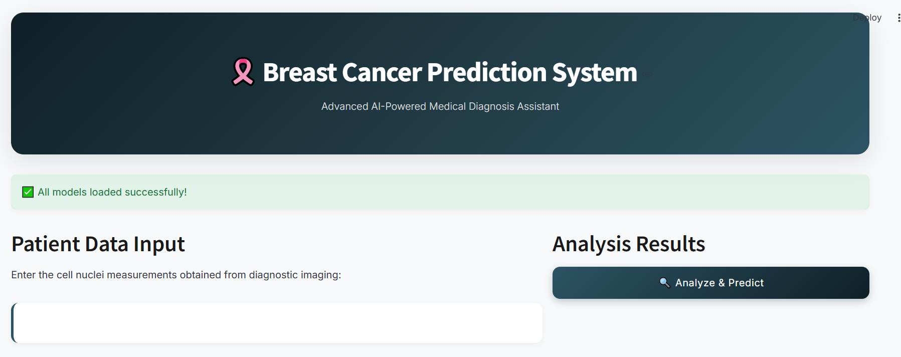
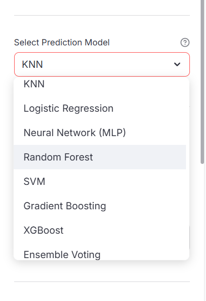
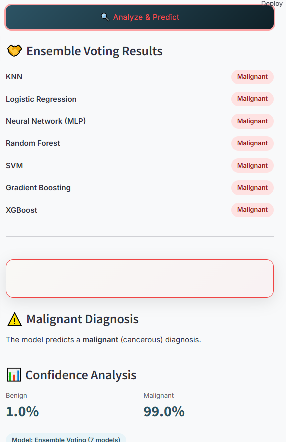

# 🩺 Breast Cancer Prediction Web Application

This project is a **machine learning–based web application** that predicts whether a breast tumor is **benign or malignant**.  
The application is built using **Python**, **Scikit-learn**, and **Streamlit**, providing an interactive and user-friendly interface.

---

##  Application Overview

###  Breast Cancer Website
<p align="center">
  
</p>

The home page introduces the application and its purpose, helping users understand how the breast cancer prediction system works.

---

### 🧠 Select Machine Learning Model
<p align="center">
  
</p>

Users can choose between different machine learning models (such as **XGBoost**, **Random Forest**, and **Gradient Boosting**) to perform predictions.

---

### 🔍 Prediction Result
<p align="center">
  
</p>

After entering medical features, the application displays the **prediction result** indicating whether the tumor is **benign or malignant**.

---

## 🧪 Machine Learning Models
- XGBoost
- Random Forest
- Gradient Boosting
- Voting Classifier (ensemble)

---

## 🛠️ Tech Stack
- Python
- Scikit-learn
- XGBoost / RandomForest
- Gradient boosting
- svm
- mlp
- knn
- logistic regression
- linear regression
- Streamlit
- Pandas & NumPy

---

## ▶️ Run the Application Locally

```bash
streamlit run app.py

